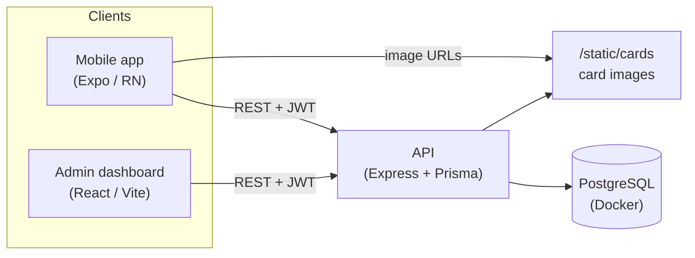

# turn — collectibles app (mock)

A simplified, brand-accurate mock of the **turn** app, built as a candidate take-home base.
It contains everything needed to run a small but realistic product across four parts:

| Part | Stack | Folder |
| --- | --- | --- |
| Mobile app | Expo + React Native + TypeScript (expo-router) | [`apps/mobile`](apps/mobile) |
| API | Node + Express + TypeScript + Prisma | [`apps/api`](apps/api) |
| Admin dashboard | React + Vite + TypeScript | [`apps/admin`](apps/admin) |
| Database | PostgreSQL (Docker) | [`docker-compose.yml`](docker-compose.yml) |
| Shared types | TypeScript | [`packages/shared`](packages/shared) |

The app lets users collect **SZN 1** cards, earn turn-coin points, and view their wallet.
Data (cards, users, points, wallet history) is seeded from the real SZN 1 collectible sheet
and the provided brand assets.

---

## Architecture



---

## Prerequisites

- **Node** >= 20 (tested on 22)
- **Docker** (for Postgres) — or any local Postgres if you prefer
- **Expo Go** (the mobile app targets **Expo SDK 54** / React Native 0.81 / React 19), or an iOS/Android simulator

---

## Quickstart

From the repo root:

```bash
# 1. Install dependencies (api, admin, shared)
npm install

# 2. Create your env file
cp .env.example .env

# 3. Start Postgres, generate the Prisma client, run migrations, and seed
npm run db:up
npm run api:setup      # = prisma generate + migrate + seed

# 4. Run the three apps (each in its own terminal)
npm run dev:api        # http://localhost:4000
npm run dev:admin      # http://localhost:5173
npm run dev:mobile     # Expo dev server — press i / a, or scan the QR
```

> The mobile app is intentionally **not** part of the npm workspace (to avoid Metro
> monorepo issues), so its dependencies install on first `npm run dev:mobile`, or you
> can pre-install with `npm --prefix apps/mobile install`.

### Seeded logins

| Role | Email | Password |
| --- | --- | --- |
| Demo user | `testing@turn.app` | `turn123` |
| Admin | `admin@turn.app` | `admin123` |

### Ports

| Service | URL |
| --- | --- |
| API | http://localhost:4000 |
| Admin | http://localhost:5173 |
| Postgres | localhost:5432 |

---

## Running the mobile app on a physical device

This works automatically — no per-machine config. The app derives the API host from the
Expo dev server it was loaded from (your computer's LAN IP), and the API returns relative
image paths that resolve against that same host. So on any computer:

```bash
npm run dev:api        # keep running
npm run dev:mobile     # scan the QR with Expo Go
```

Requirements: your phone and computer are on the **same Wi-Fi**, and your computer's
firewall allows incoming connections on port 4000 (macOS may prompt the first time).

Overrides (only if needed):

- **Tunnel / different network:** `npm run dev:mobile -- --tunnel`, or set an explicit
  API base with `EXPO_PUBLIC_API_URL=http://<host>:4000 npm run dev:mobile`.
- **Simulator / emulator:** works out of the box (localhost on iOS, `10.0.2.2` on Android).

---

## What's included

**Mobile (core screens):**

- **Login** — seeded email/password, JWT stored in SecureStore
- **Home** — turn wordmark, points balance + tier bar, "your wallet", featured SZN1 / retrovision tiles
- **Collectibles** — 3-column grid; owned cards show art, unowned show a locked card back
- **Card detail** — full art, story, rarity/type/universe, tier
- **Wallet** — balance, tier bar, transaction history (matches the design)
- **Scan to collect** — camera QR scanner (or manual code entry) that redeems a single-use
  code to collect the card and award points (new card = points, duplicate = extra copy only)
- **Account** — profile + logout
- **Shop** tab is a branded "coming soon" placeholder (see below)

**API:** `POST /auth/login`, `GET /auth/me`, `GET /seasons`, `GET /cards`, `GET /cards/:id`,
`GET /wallet`, `POST /scan`, plus admin routes under `/admin` (cards CRUD with image upload,
per-card ownership stats, users + points, and QR-code batches).

**Admin:** two top-level tabs, **Collections** and **Users**.

- **Collections** drills down: **Collections** (e.g. SZN 1, Retrovision, each showing card
  count + how many codes have been scanned) → open one to see its **cards** (add / edit /
  delete with image upload) → open a card for its **detail page**: how many people have it,
  total copies out, its owners, and full **QR-code management** — make more codes in
  **batches**, print them (each renders a scannable QR), and track each code's status:
  scanned or not, **when**, and **by whom**.
- **Users** — view each user's card collection and full points history, and add points.

### How scanning works

Each QR code encodes a unique single-use token (e.g. `TURN-AB12…`). When a user scans it (or
types it on the Scan tab), the API marks the code as used, adds the card to their collection,
and — only the first time they collect that card — records a `+points` transaction. Generate
codes in **Admin → Collections → (a collection) → (a card) → QR codes**, then scan them from
the mobile **Scan** tab. No printer needed to test: copy a code from the card's code table and
use "enter a code manually" in the app.

---

## How to add a feature (for candidates)

The codebase is deliberately small and typed end-to-end so you can add a vertical slice
across the stack. A typical feature touches:

1. **DB** — add/adjust a model in [`apps/api/prisma/schema.prisma`](apps/api/prisma/schema.prisma),
   then `npm run api:migrate`.
2. **API** — add a route in [`apps/api/src/routes`](apps/api/src/routes) and wire it in
   [`apps/api/src/index.ts`](apps/api/src/index.ts).
3. **Shared types** — add DTOs in [`packages/shared/src/index.ts`](packages/shared/src/index.ts)
   (and mirror in [`apps/mobile/src/types.ts`](apps/mobile/src/types.ts)).
4. **Mobile** — add a screen under [`apps/mobile/app`](apps/mobile/app) (file-based routing)
   and call it from [`apps/mobile/src/api.ts`](apps/mobile/src/api.ts).
5. **Admin** (optional) — add management UI in [`apps/admin/src/pages`](apps/admin/src/pages).

**Clean extension points already stubbed for you:**

- The **Shop** tab ([`apps/mobile/app/(tabs)/shop.tsx`](apps/mobile/app/(tabs)/shop.tsx))
- The **reward store** / **trading board** tabs on the Collectibles screen

The **scan-to-collect** flow is already implemented end-to-end (DB `QrCode` model →
`POST /scan` → mobile camera in [`apps/mobile/app/scan-camera.tsx`](apps/mobile/app/scan-camera.tsx)
→ admin QR management), so it doubles as a full worked example of a vertical slice you can
model new features on.

---

## Useful scripts

| Command | Description |
| --- | --- |
| `npm run db:up` / `db:down` | Start / stop Postgres |
| `npm run db:reset` | Drop the volume and restart Postgres (fresh DB) |
| `npm run api:setup` | Generate client + migrate + seed |
| `npm run api:seed` | Re-seed the database |
| `npm run dev:api` / `dev:admin` / `dev:mobile` | Run each app |

---

## Troubleshooting

- **Docker daemon hangs / `docker` commands don't respond:** restart Docker Desktop, then
  re-run `npm run db:up`. If you can't use Docker, run any local Postgres and set
  `DATABASE_URL` in `.env` accordingly.
- **Mobile "Network error" on a physical device:** make sure the API is running
  (`npm run dev:api`) and that your phone and computer share the same Wi-Fi. If your
  firewall blocks it, allow incoming connections on port 4000, or use
  `npm run dev:mobile -- --tunnel`.
- **Card images don't load:** they load from the same host the app used to reach the API,
  so if the app itself works, images will too. If you set a custom `EXPO_PUBLIC_API_URL`,
  make sure it's reachable from the device.
